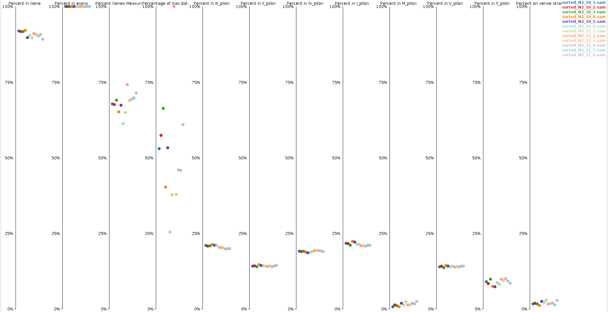

```{r setup, include=FALSE}
knitr::opts_chunk$set(echo = TRUE)
library(knitr)
library(edgeR)
library(rtracklayer)
library(xlsx)
```
  
  
## Inhoud: {#content}
1. [Inleiding](#inleiding)
2. [Oorsprong Data](#data)
3. [Kwaliteit Data](#kwal)
4. [Mappen, indexeren en tellen](#map)
5. [Normalisatie, p waardes en fold-changes](#norm)
6. [Conclusie](#conclusie)
7. [Bronvermelding](#bron)
<br>  
<br>  
  
## 1.Inleiding {#inleiding}
Dankzij de grote, transparantie, snelle voortplanting en eenvoudige leefomstandigheden waarin C. elegans kan groeien maakt het een uitstekend organisme voor biologisch en medisch onderzoek. Daarnaast is er bekend welke cellen waar vandaan komen tijdens de ontwikkeling van een C. elegans ([Sulston & Horvitz, 1977](#sulston)). Dit onderzoek heeft zelfs de nobelprijs gewonnen.
  
Vanwege de eigenschappen van C. elegans en de vele kennis die beschikbaar is is het aantrekkelijk om onderzoek te doen naar de gevolgen van bepaalde omstandigheden zoals bijvoorbeeld hoe reageert C. elegans onder stress. Eén manier om de gevolgen te achterhalen is te kijken naar de gen expressie waarmee je op moleculair niveau uitspraak kan doen over de respons op een bepaalde omstandigheid.
  
Eén veelvoudig gebruikte techniek om de gen expressie te meten is met RNASeq. Bij RNASeq wordt met bijvoorbeeld Oligo dT primers mRNA's geselecteerd en gesequenced. Vervolgens kan aan de hand van de ratio in read counts tussen de controle en sample bepaald worden welke genen betrokken zijn bij de respons.
  
In dit docement staat beschreven hoe RNASeq data van een voorbeeld onderzoek wordt verwerkt, gefilterd, genormaliseerd en vergeleken.
  
###### [Terug naar Inhoud](#content)
<br>  
<br>  
  
## 2.Oorsprong Data {#data}
De C. elegans RNA sequentie dataset is afkomstig van Georgia Institute of Technology (NCBI BioProject: [PRJNA437304](https://www.ncbi.nlm.nih.gov/Traces/study/?acc=SRP134126)). De dataset bestaat uit 24 sample waarvan de helft behoort tot C.elegans N2 en de andere tot C.elegans CX12311. Alle C.elegans waren jong volwassen hermafrodieten en de gehele lichaam is gebruikt voor RNA extractie.  
  
Om te voorkomen dat de complexiteit van dit project te hoog wordt is er besloten om alleen door te gaan met de samples van C.elegans N2. Deze groep bestaat twee subgroepen met ieder 6 biologische replicaten. Hiervan had ene groep 10% zuurstof en de andere 20%. Door te kijken naar verschillen in mRNA expressie kan bepaald worden welke pathways beïnvloed worden door de concentratie zuurstof in de omgeving van de C.elegans.

###### [Terug naar Inhoud](#content)
<br> 
<br>  
  
## 3.Kwaliteit Data {#kwal}
Na het downloaden van de data zijn de fastq bestanden ingeladen in FastQC. Na het analyseren van de nucleotide percentage per positie is gebleken dat de eerste 14 nucleotides behoren tot de primer en de laatste posities 73 tot 76 een sterk verhoogd tyrosine en cytosine percentage bevatten (zie figuur 1). Na het bekijken van de kwaliteitsscore per positie (zie voorbeeld in figuur 2) is gebleken dat grotendeels een score heeft boven de 28. Alleen de foutmarges van de scores komen soms lager te liggen. Daarnaast is gebleken dat de reads van elk bestand een lengte hadden tussen de 35 en 76 nucleotiden en altijd een GC percentage hadden van 46%. Het aantal reads per bestand verschilde wel. Zo waren er gemiddeld 12996525 reads per bestand met minimaal 2515382 en maximaal 25153572 reads. 
  

  
###### *__Figuur 1.: Voorbeeld lijngrafiek met nucleotide percentage per positie. Hierbij is op de X-as de positie weergegeven en op de Y-as de percentage. De rode lijn staat voor tyrosine, blauw voor cytosine, groen voor adenine en zwart voor guanine. Afbeelding gemaakt met FastQC  0.11.8 ([Andrews, 2018](#andrews)).__*  
<br>  
  

  
###### *__Figuur 2.: Grafiek met de kwaliteitsscore (Y-as) per positie (X-as). De foutmarge van de kwaliteitsscore per positie is in de grafiek weergegeven met error balken. De kleuren geven aan welke scores goed zijn (groen) en welke minder (geel) of slecht (rood) zijn. Afbeelding gemaakt met FastQC 0.11.8 ([Andrews, 2018](#andrews)).__*  
<br>  
  
Na aanleiding van de resultaten die hierboven zijn besproken is er besloten om de reads te trimmen zodat de eerste 14 en de laatste 3 nucleotide zijn verwijderd. Ook is er als regel geweest dat de reads na het trimmen niet kleiner mogen zijn dan 20 nucleotiden. Na het trimmen zijn er gemiddeld 3395 reads of 0.03% verwijderd per bestand. Na het bekijken van de fastqc resultaten is er een verbetering te zien als we kijken naar de nucleotides percentages per positie zoals te zien is in figuur 3 en de kwaliteit per positie in figuur 4.  
<br>  
    

  
###### *__Figuur 3.: Voorbeeld lijngrafiek met nucleotide percentage per positie. Hierbij is op de X-as de positie weergegeven en op de Y-as de percentage. De rode lijn staat voor tyrosine, blauw voor cytosine, groen voor adenine en zwart voor guanine. Afbeelding gemaakt met FastQC  0.11.8 ([Andrews, 2018](#andrews)).__*  
<br>  
  
  
  
###### *__Figuur 4.: Grafiek met de kwaliteitsscore (Y-as) per positie (X-as). De foutmarge van de kwaliteitsscore per positie is in de grafiek weergegeven met error balken. De kleuren geven aan welke scores goed zijn (groen) en welke minder (geel) of slecht (rood) zijn. Afbeelding gemaakt met FastQC 0.11.8 ([Andrews, 2018](#andrews)).__*  
  
###### [Terug naar Inhoud](#content)
<br>  
<br>  
  
## 4.Mappen, indexeren en tellen {#map}  
Na het knippen van de reads zijn ze gemapt op het referentie genoom C. elegans [PRJEB28388](https://www.ncbi.nlm.nih.gov/bioproject/?term=PRJEB28388). Het mappen is uitgevoerd met Hisat2 ([Pertea et al, 2016](#pertea)) met de default instellingen en met paired read bestanden. Tijdens het uitvoeren van deze functie kon zo'n 98% gemapped worden.
```{bash eval = FALSE, echo = TRUE}
# Voorbeeld van hisat2 zoals die gebruikt is binnen het project
# De x variable staat voor de referentie genoom
# De 1 en 2 staan voor de bestanden met de paired reads
# De S variable is de output bestand. Hierbij is er gekozen voor SAM zodat er met het blote oog gecontroleerd 
$ hisat2 -x c_elegans.PRJEB28388.WS271.genomic -1 forward_trimmed_N2_10_1.fastq -2 reverse_trimmedN2_10_1.fastq -S N2_10_1.sam
```
  
Indexen en sorteren is uitgevoerd met Samtools ([Li et al, 2009](#li)).
```{bash eval = FALSE, echo = TRUE}
# Voorbeeld van Samtools zoals die gebruikt is binnen het project
# De n variable is voor de input
# De o variable is voor de output
$ samtools sort -n N2_10_1.sam -o sorted_N2_10_1.sam
```
  
<br>
Daarna zijn de resultaten gecontroleerd door een QC-plot (zie figuur 5) te maken met behulp van seqMonk 1.45.1 ([Andrews, 2019](#andrews2)).
In de QC is te zien dat alle reads voorkomen in de exonen en bijna niks in mitochondriaal DNA. Dit komt overeen met de verwachting. Ondanks de verwachting is gebleken dat bijna alle reads op het antisense strand liggen. Mogelijk is er iets fout gegaan bij het uitvoeren van de functies of is het scheiden van sense en antisense sequenties niet goed gegaan. De oorzaak van dit probleem is nog niet gevonden en toekomstig onderzoek zou hier verder naar kunnen zoeken.  
Ondanks deze tegenslag kan er nog wel doorgewerkt worden met de data maar er moet wel bij het analyseren van de resultaten rekenening meegehouden worden dat er informatie verloren is gegaan.

 
  
######*__Figuur 5.: QC-plot van de samples. Per kolom is er een verdeling weergegeven van de samples per onderwerp. Elke onderwerp is als titel weergeven en elke sample heeft een eigen kleur. De kleuren staan uitgelegd in de legenda. Gemaakt met seqMonk 1.45.1 ([Andrews, 2019](#andrews2)).__*  
<br>
Vervolgens zijn de reads per gen geteld met behulp van htseq-count functie ([Anders et al, 2015](#anders)).
```{bash eval = FALSE, echo = TRUE}
# Voorbeeld van htseq-count zoals die gebruikt is binnen het project
# De r name variable is voor de input
# De annotation bestand bevat de gegevens waar de genen liggen
# De > bestand constructie verteld dat de resultaten in het volgende bestand moeten worden opgeslagen
$ htseq-count -r name sorted_N2_10_1.sam c_elegans.PRJEB28388.WS271.annotations.gtf > counts_N2_10_1.txt
```
  
  
###### [Terug naar Inhoud](#content)
<br>  
<br>  
  
# Normalisatie, fold-changes en p waardes {#norm}
Om te normaliseren, fold-changes te bepalen en p waardes te berekenen is er gebruik gemaakt van de edgeR package versie 3.26.4 ([Chen et al, 2019](#chen)).  
  
De eerste stap is het inladen van de getelde reads die geproduceerd zijn met hisat-count. Voor makkelijkere anotatie worden de samples met 10% zuurstof A genoemd en de samples met 20% zuurstof B.
```{r}
# Haal count bestanden op en fuseer ze
counts <- NULL
for (run in c("10_1", "10_2", "10_3",
              "10_4", "10_5", "10_6", 
              "21_1", "21_2", "21_3", 
              "21_4", "21_5", "21_6")) {
  
  countTable <- data.frame(
          read.csv(
            paste("counts_N2_",run,".txt",sep = ""),
            sep = "\t",
            col.names = c("Genes", 
                          run),
            header = FALSE))
  if (is.null(counts)){
    counts = countTable
  }
  else{
      counts <- Reduce(function(...) merge(..., by = "Genes" ,
                                           all=TRUE), 
                 list(countTable,counts))
  }
}
remove(countTable)

# De samples worden herbenoemd voor een duidelijkere anotatie in de toekomstige grafieken
names(counts) <- c("Genes",
                   "A1","A2","A3",
                   "A4","A5","A6",
                   "B1","B2","B3",
                   "B4","B5","B6")

# Verwijder de counts van de non-gene annotatie
counts <- counts[6:nrow(counts),]

# Verander de rij namen in de genen en verwijder de Genes kolom
row.names(counts) <- counts[,1]
counts <- counts[,2:ncol(counts)]
```
  
Vervolgens zijn de counts omgezet naar een DGEList object, gefilterd en genormaliseerd met de "trimmed mean of M-values" methode ([Robinson & Oshlack 2010](#robinson)).
```{r}
# Make een factor vector met de conditie annotatie
group <- factor(rep(c("A","B"), each = 6))

# Maak de DGEList object zodat edgeR ermee kan werken
dgelist <- DGEList(counts = counts, 
                   group = group,
                   genes = rownames(counts))
remove(counts,group)

# Bepaal de counts per million om de genen te filteren die in geen 1 sample voorkomen. 
countspermillion <- cpm(dgelist)
countCheck <- countspermillion > 1
keep <- which(rowSums(countCheck) >= 2)
dgelist <- dgelist[keep,]

# Bereken de normalissatie factors van de data
normData <- calcNormFactors(dgelist,method = "TMM")
remove(countspermillion,countCheck,keep,dgelist)
gc()

# Maak de design matrix
design <- model.matrix(~0+group, data=normData$samples)
colnames(design) <- levels(normData$samples$group)
```

Daarna is de spreiding bepaald en de resultaten geplot. Zoals te zien is op de X-as in figuur 6 is er een duidelijk verschil te zien tussen de samples die 10% zuurstof hadden (groep A) en de samples met 20% zuurstof (groep B). Als er gekeken wordt naar de Y-as is er wel een redelijk verschil te zien tussen samples binnen een groep.
```{r}
# Schat de spreiding
normData <- estimateGLMCommonDisp(normData,design)
normData <- estimateGLMTrendedDisp(normData,design, method="power")
normData <- estimateGLMTagwiseDisp(normData,design)
```
```{r}
# Plot de resultaten
plotMDS(normData, main = "MDS plot")
```
  
######*__Figuur 6.: Een MDS plot van de samples met 10% (groep A) en 20% (groep B) zuurstof in de directe omgeving. De X-as geeft de spreiding aan tussen de condities en de Y-as geeft de spreiding aan tussen de samples. Gemaakt met edgeR 3.26.4 ([Chen et al, 2019](#chen)).__*  

<br> 
Om meer te weten te komen over verspreding van de samples en genen zijn er verschillende plots gemaakt. Zo is in figuur 7 een boxplot te zien van de counts als log2 waardes. Hierin is te zien dat er niet heel veel verschil zit tussen conditie A en B. Aangezien het zeer waarschijnlijk is dat grotendeels van de genen niet beïnvloed worden door de zuurstof concentratie is dit resultaat naar verwachting.
```{r}
# Normaliseer de counts op basis van de berekdnde normalisatie factors.
normCounts <- normData$counts * matrix(rep(normData$samples$norm.factors, times = nrow(normData$counts)), ncol = 12, byrow = TRUE) 

# tranformeer het naar een matrix en maak een log2 matrix
countMatrix <- as.matrix(normCounts)
logMatrix <- log2(countMatrix+1)

# Verwijder de rijen met NA waardes
logMatrix <- na.omit(logMatrix)
countMatrix <- na.omit(countMatrix)
 
# Visualiseer de variatie binnen elke sample
colour <- rep(c("green","red"), each = 6)
boxplot(logMatrix, main = "Log2 read counts", ylab = "log2", col = colour)
```  
  
######*__Figuur 7.: Boxplots van de log2 read counts binnen de samples. Op de X-as staan de sample namen en de Y-as bevat de log2 waardes van de genormaliseerde counts. De groene boxplots zijn de samples met 10% zuurstof en de rode met 20% zuurstof.__*  
  
<br> 
Daarna is er een dendrogram gemaakt (zie figuur 8). Hierin is te zien dat er geen duidelijk onderscheid wordt gemaakt tussen de twee condities terwijl dit wel naar voren kwam in figuur 6. Mogelijk komt dit doordat dendrogrammen gevoeliger zijn dan MDS plots en de verschillen over het algemeen niet groot zullen zijn.
```{r}
# Visualiseer de dentogram om de afstanden tussen samples weer te geven
plot(hclust(dist(t(countMatrix), method="eu")), sub = "" ,xlab = "", ylab = "Distance")
```  
  
######*__Figuur 8.: Een dendrogram die de afstanden tussen de samples weergeeft. De afstand is weergeven op de Y-as. De A samples zijn de samples met 10% zuurstof en de B samples met 20% zuurstof__*  
  
<br> 
Ondanks het gebrek aan grote verschillen in figuur 7 en 8, is er in figuur 9 wel een grote variatie te zien in PC1. Dit verteld dat er wel degelijk een verschil zit tussen de twee groepen en dat dit redelijk linear is.
```{r}
# Visualiseer de principle componets
pr <- prcomp(countMatrix, scale.=TRUE)
plot(pr, main = "PCA plot")
```
  
######*__Figuur 9.: Een 1 dimensionale PCA plot. De variatie van elke principle component (PC) is weergeven op de Y-as en de PCs staan gesorteerd van 1 tot 10 op de X-as.__*  
   
<br>  
Bij het bekijken van figuur 10 is te zien dat niet alle genen binomiaal verdeeld zijn. Dit is te zien doordat de trendlijn (blauw) niet plat ligt op de commonlijn (rood). Vooral de genen met relatief laag aantal reads zijn minder goed. Om ervoor te zorgen dat deze genen alsnog binomiaal verdeeld worden is er gebruik gemaakt van edgeR functies.
```{r}
plotBCV(normData, main = "BCV plot")
```
  
######*__Figuur 10.: Een BCV plot met op de X-as de gemiddelde log van het aantal reads per miljoen en op de Y-as de variatie. De rode lijn geeft aan hoe hoog de variatie moet zijn voor de data om binomiaal verdeeld te zijn. De blauwe lijn geeft de trend aan binnen de data. Gemaakt met edgeR 3.26.4 ([Chen et al, 2019](#chen)).__*  
  
```{r}
# Corrigeer voor de trend lijn in figuur 6
fit <- glmFit(normData,design)

# Bereken de fold-changes en bereken P en FDR waardes
mc <- makeContrasts(exp.r=A-B, levels=design)
fit <- glmLRT(fit, contrast=mc)
res <- as.data.frame.TopTags(topTags(fit, n = Inf))
head(res, n = 10)
```
  
Als laatst zijn de resultaten aangevuld met metadata en weggeschreven in een excel bestand. Dit bestand kan vervolgens gebruikt worden in een Gene Set Enrichment Analysis (GSEA) ([Subramanian et al, 2005](#subramanian)) om de betrokken pathways te analyseren en te bepalen welke pathways beïnvloed worden door de zuurstof concentratie.
```{r include = FALSE}
rm(list = setdiff(ls(),"res"))
gc()
```
```{r}
gff <- import.gff3("c_elegans.PRJEB28388.WS271.annotations.gff3")
gff <- as.data.frame(gff)
names(gff)[10] <- "genes"
res <- Reduce(function(...) merge(..., by = "genes" ,all=TRUE), 
                 list(res,gff))
res <- res[!is.na(res$PValue),]
write.xlsx2(res,"results.xlsx")
```
  
  
###### [Terug naar Inhoud](#content)
<br>  
<br>   
  
# Conclusie {#conclusie}
In het onderzoek zijn 12 fastQ bestanden met C. elegans RNASeq data verwerkt, geanalyseerd en klaar gemaakt voor toekomstig onderzoek. Hierbij is naar boven gekomen dat er adaptor sequentie aanwezig is en dat er iets mis is gegaan waardoor alles sequenties op de antisense liggen. Daarnaast is er in de MDS plot te zien dat er duidelijk onderscheid gemaakt kan worden tussen conditie A (10% zuurstof) en conditie B (20% zuurstof) maar dit is niet terug te zien in de dendrogram.  
Toekomstig onderzoek zal GSEA ([Subramanian et al, 2005](#subramanian)) moeten gebruiken om achter zien te komen welke pathways beïnvloed worden door een verschil in zuurstof percentage.
  
  
###### [Terug naar Inhoud](#content)
<br>  
<br> 
  
## Bronvermelding {#bron}
#####1. Anders S., Pyl P.T., Huber W. (2015) HTSeq--a Python framework to work with high-throughput sequencing data. Bioinformatics. 2015;31(2):166-9. {#anders}
#####2. Andrews S. (2018) FastQC. Babraham Bioinformatics. Geraadpleegd op 11-05-2019 van https://www.bioinformatics.babraham.ac.uk/projects/fastqc/ {#andrews}
#####3. Andrews S. (2019) seqMonk. Babraham Bioinformatics. Geraadpleegd op 11-05-2019 van https://www.bioinformatics.babraham.ac.uk/projects/seqmonk/ {#andrews2}
#####3. Chen Y., Lun A., Mc-Carthy D., Zhou X., Robinson M., Smyth G. (2019) Empirical Analysis of Digital Gene Expression Data in R. Geraadpleegd op 09-06-2019 van http://bioinf.wehi.edu.au/edgeR {#chen}
#####4. Li H., Handsaker B., Wysoker A.,  Fennell T., Ruan J., Homer N., Marth G., Abecasis G., Durbin R., 1000 Genome Project Data Processing Subgroup (2009) The Sequence Alignment/Map format and SAMtools. Bioinformatics. 2009;25(16):2078-9. {#li}
#####5. Pertea M., Kim D., Pertea G.M., Leek J.T., Salzberg S.L. (2016) Transcript-level expression analysis of RNA-seq experiments with HISAT, StringTie and Ballgown. Nat Protoc. 2016;11(9):1650-67. {#pertea}
#####6. Robinson M.D., Oshlack A. (2010). A scaling normalization method for differential expression analysis of RNA-seq data. Genome Biology 11, R25.{#robinson}
#####7. Subramanian A., Tamayo P., Mootha V.K., Mukherjee S., Ebert B.L., Gillette M.A., Paulovich A., Pomeroy S.L., Golub T.R., Lander E.S., Mesirov J.P. (2005) Gene set enrichment analysis: a knowledge-based approach for interpreting genome-wide expression profiles. Proc Natl Acad Sci USA. 2005;102(43):15545-50. {#subramanian}
#####8. Sulston J.E, Horvitz H.R. (1977) Post-embryonic cell lineages of the nematode, Caenorhabditis elegans. Dev Biol. 1977;56(1):110-56. {#sulston}
